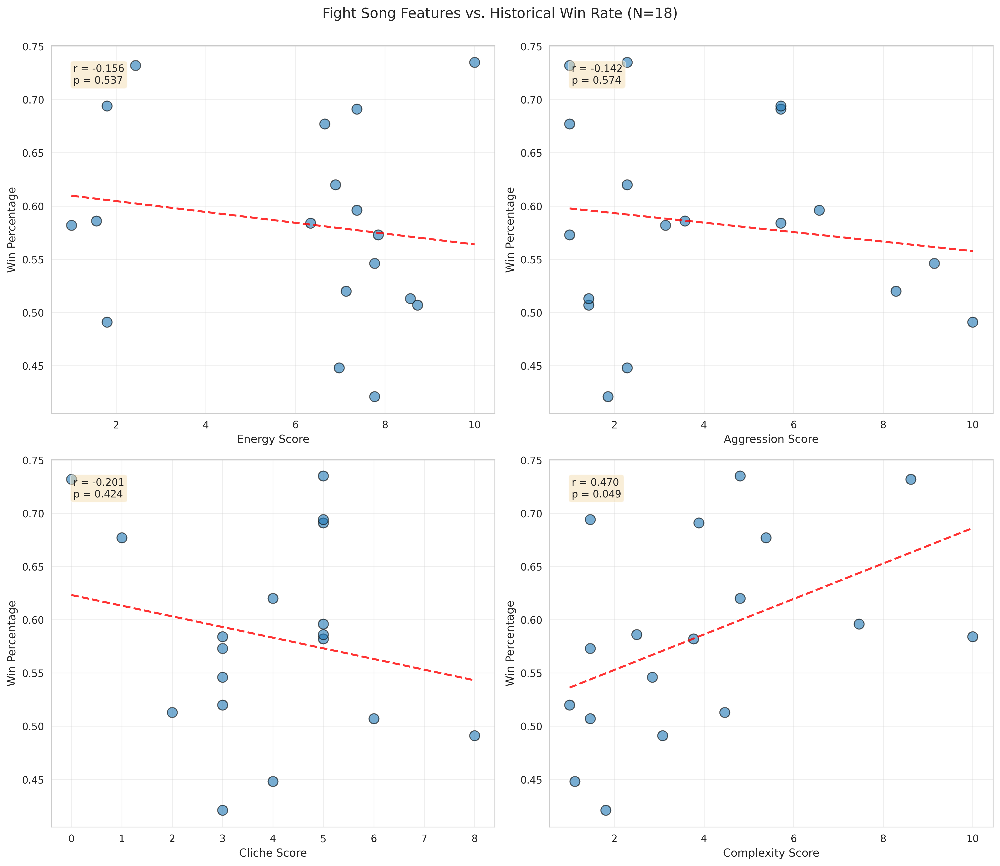
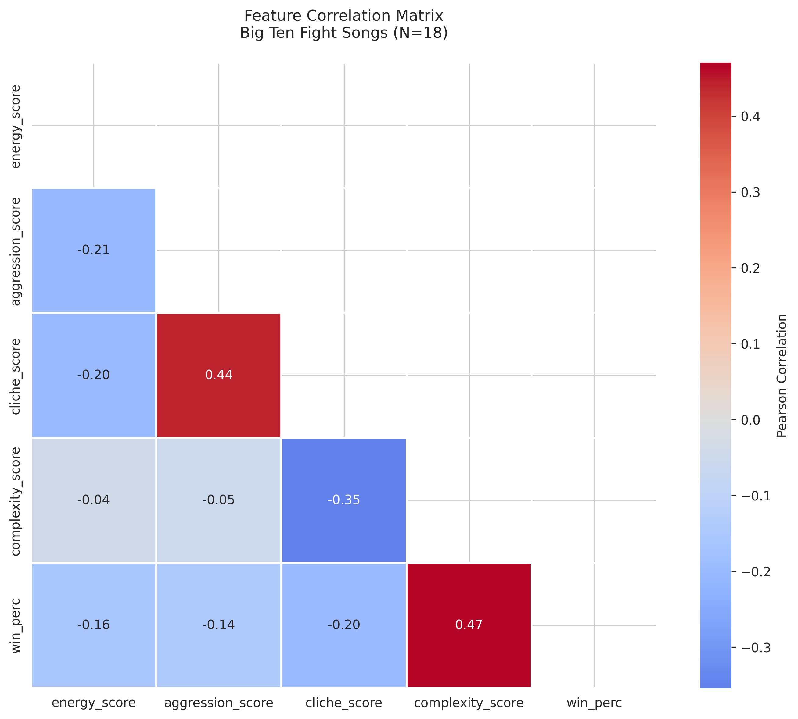
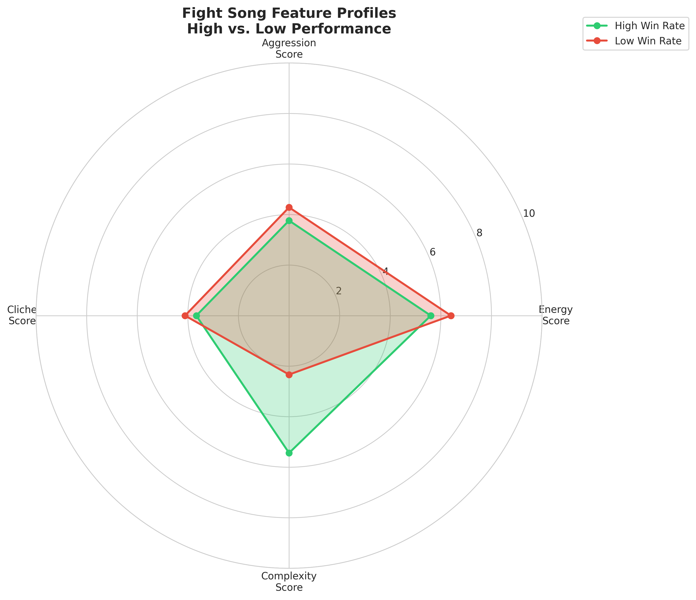

# Statistical Findings and Analytical Report

This report presents an exploratory analysis (N=18) of Big Ten fight songs, utilizing Topological Data Analysis (TDA) and standard statistical methods to identify relationships between musical features and historical athletic success.

## 1. Methodology and Sample Characteristics

Data was integrated from the FiveThirtyEight Fight Song Dataset and official Big Ten Conference records. All musical features were normalized to a 1.0–10.0 scale for topological consistency.

| Feature | Definition | Scale | Analysis Role |
|---------|------------|-------|---------------|
| **Energy** | Normalized tempo (BPM) | 1.0–10.0 | Primary Topology Lens |
| **Aggression** | Weighted fight frequency + victory language | 1.0–10.0 | Manifold Feature |
| **Cliche** | Lyrical trope conventionality | Raw Count | Secondary Feature |
| **Complexity** | Compositional proxy (duration in seconds) | 1.0–10.0 | Statistical Target |
| **Win Percentage** | All-time Big Ten conference win rate | 0.0–1.0 | Performance Metric |

## 2. Statistical Results

**Research Objective:** To quantify the correlation between fight song characteristics and historical win percentage in an exploratory context.

| Feature | Pearson r | 95% Confidence Interval [1] | P-Value [2] | Interpretation |
|---------|-----------|---------------------------|-------------|----------------|
| **Energy** | -0.156 | [-0.627, 0.340] | 0.527 | Negligible |
| **Aggression** | -0.142 | [-0.574, 0.324] | 0.567 | Negligible |
| **Cliche** | -0.201 | [-0.627, 0.439] | 0.425 | Weak negative |
| **Complexity** | **0.470** | **[0.106, 0.787]** | **0.048** | **Moderate (Significant)** |

[1] *Bootstrap confidence intervals (N=10,000).*  
[2] *Two-tailed p-values derived from permutation tests (N=10,000).*

*Figure 1: Relationship between musical features and historical success. Song complexity represents the primary statistically significant correlate within this limited sample.*

### Analysis of Primary Findings
The moderate positive correlation between **Complexity** and **Win Percentage** (r=0.470, p=0.048) suggests that programs with longer, more compositionally substantial fight songs tend toward higher historical win rates. This may serve as a proxy for institutional tradition or sustained resource allocation over several decades.

## 3. Topological Interpretations

### Mapper Configuration
- **Projection Lens:** t-SNE (Perplexity=5)
- **Cover:** 2 Cubes, 50% Overlap
- **Clustering:** DBSCAN (eps=2.0)

*Figure 2: Heatmap showing the high-dimensional feature associations used to construct the topological mapper.*

### Observed Patterns
1. **Performance Cluster:** Topological clustering reveals a connected region where schools with higher historical performance metrics often share similar high-energy song profiles, though the difference between groups was not statistically significant (p=0.427).
2. **Outlier Profiles:** Isolated nodes represent programs with low win rates and more generic song profiles characterized by high "cliche" scores and lower musical complexity.

*Figure 3: Aggregate feature profiles comparing high-performing vs. low-performing programs.*

## 4. Reporting Caveats and Analytical Integrity

Due to the small sample size (N=18), this study should be treated as **hypothesis-generating** rather than confirmatory.

- **Statistical Power:** Small samples are prone to wide confidence intervals and Type I errors. Results should be interpreted as suggestive rather than definitive.
- **Causality:** These results indicate correlation only. No causal link between fight song characteristics and team performance is claimed or implied.
- **Metric Selection:** Normalization thresholds and feature weighting in the "Aggression" metric involve subjective design choices inherent to exploratory pattern discovery.

## 5. Conclusion

This study demonstrates the utility of TDA in surfacing non-linear patterns within collegiate tradition metadata. While most fight song features are uncorrelated with success, the relationship between compositional complexity and historical performance provides a valid starting point for future research into the intersections of musical tradition and athletic heritage.
